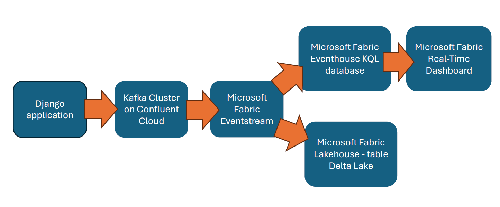
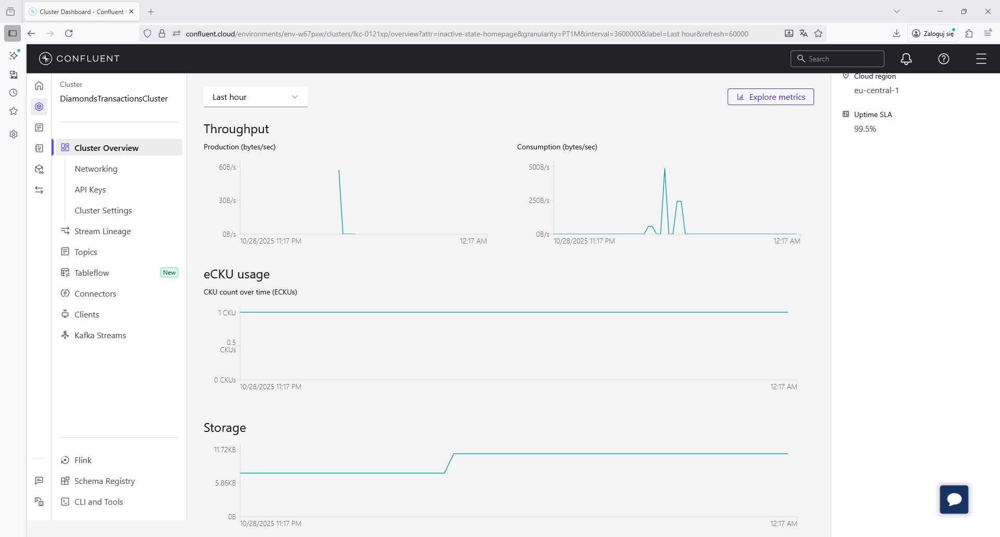
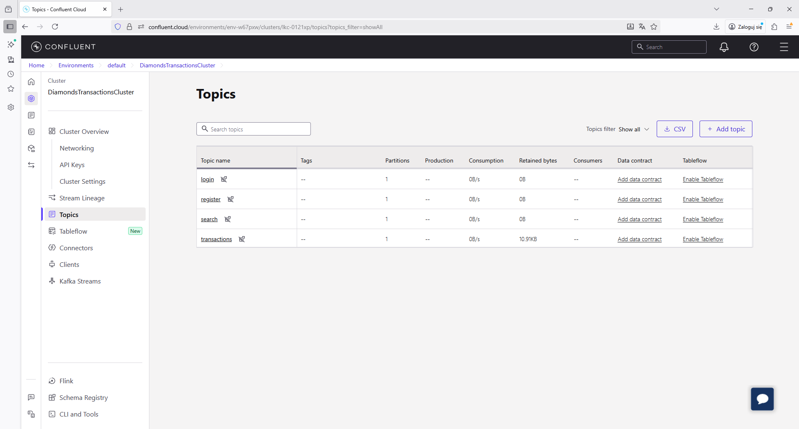
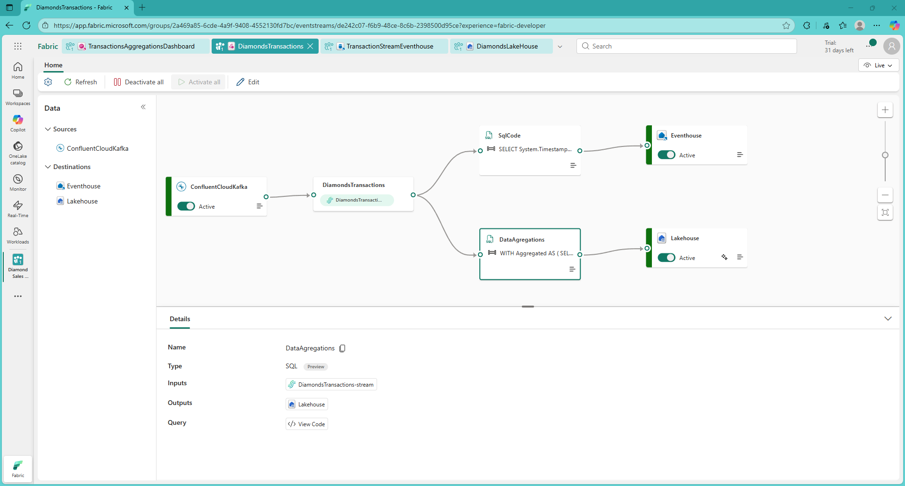
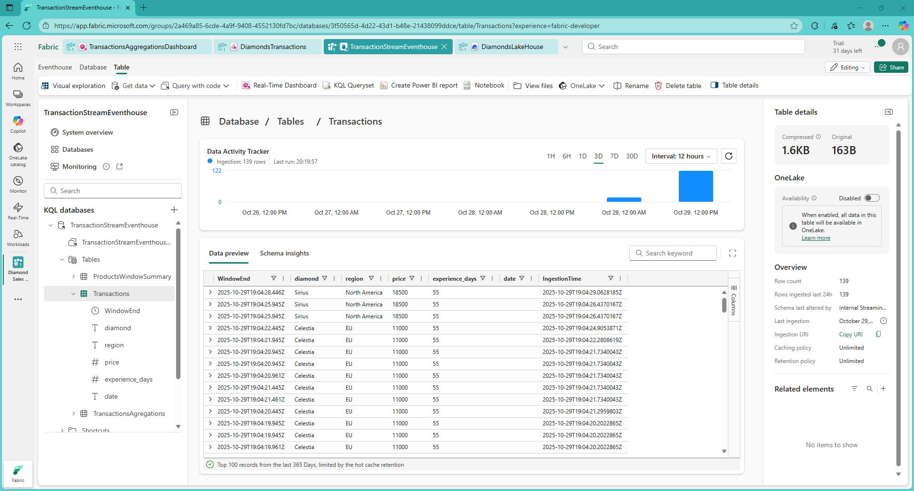
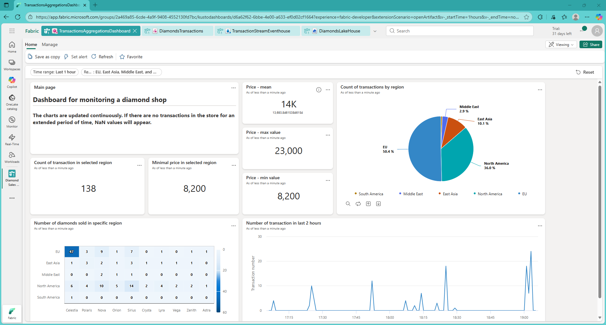
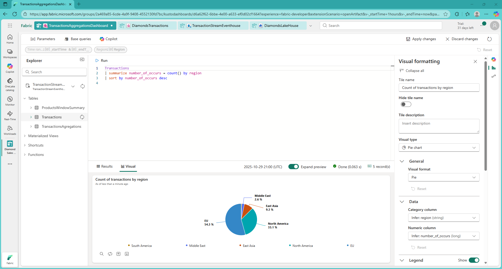
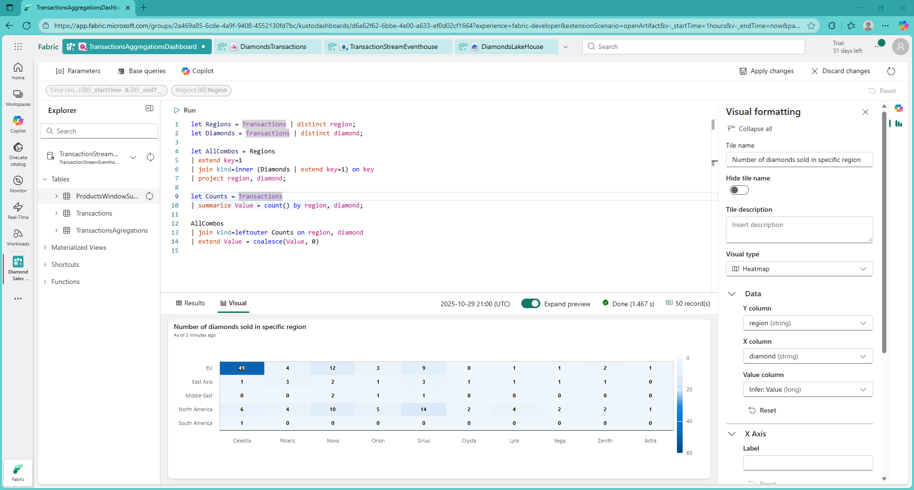

# Introduction

The goal of this project is to create a monitoring system for a fictitious online diamond store.

The fictitious online diamond store was written in Python using the Django framework. To accommodate various scenarios, users can purchase a diamond with a single click, change its price, change their region of origin, and change the account's length of time. This is intended to easily generate a data stream similar to that provided by a real online store—although data such as experience time or region of origin cannot be changed in a real online store. The goal here is to easily replicate the scenario where data on user actions and transactions is received from a real online store.

# 1. Real-time monitoring system project

The system architecture consists of several elements. The first is a django application—a fictional diamond shop—that contains a Kafka producer. The next element is a Kafka Cluster on Confluent Cloud. It collects messages sent from django and makes them available to Kafka consumers.

The Eventstream service on Microsoft Fabric was chosen as the consumer. It allows for processing data in a stream and writing to a sink—for example, a KQL database in the Eventhouse service.

The Real-Tim Dashboard will use data written to the appropriate table in Eventhouse using KQL instructions.

In this case, the stream will be split into two parts—one will be dedicated to the Real-Time dashboard, and the other will be used to archive statistics in the Delta Lake table in Lakehouse.



# 2. Kafka Producer in django application in docker-compose

For a Django application to be monitored using the system described, it must contain a Kafka producer instance. This can be a tool—utlis—in the appropriate folder. A sample implementation is shown below.

```{python}
#| eval: false
#| include: true
from kafka import KafkaProducer
import threading
import json  
from typing import Dict, Any 
import os
import ssl
KAFKA_BOOTSTRAP = os.environ.get('KAFKA_BOOTSTRAP_SERVERS')
SECURITY_PROTOCOL = os.environ.get('KAFKA_SECURITY_PROTOCOL', 'SASL_SSL')
SASL_MECHANISM = os.environ.get('KAFKA_SASL_MECHANISMS', 'PLAIN')
SASL_USERNAME = os.environ.get('KAFKA_SASL_USERNAME')
SASL_PASSWORD = os.environ.get('KAFKA_SASL_PASSWORD')

def _send_message_sync(message_bytes: bytes, topic: str):
    """
    The purpose of this function is to send byte messages 
    to the Kafka Cluster on Confluent Cloud.
    """
    try:
        producer = KafkaProducer(
            bootstrap_servers=KAFKA_BOOTSTRAP,
            security_protocol=SECURITY_PROTOCOL,
            sasl_mechanism=SASL_MECHANISM,
            sasl_plain_username=SASL_USERNAME,
            sasl_plain_password=SASL_PASSWORD,
            ssl_context=ssl.create_default_context(),
        )
        producer.send(topic, message_bytes)
        print(f"✅ Sent JSON to {topic}")
        producer.flush()
        producer.close()
    except Exception as e:
        print(f"[kafka_utils] ❌ Error: {e}")

def send_kafka_message_background(transaction_data: Dict[str, Any], topic: str):
    """
    It takes a dictionary of transaction data, converts it to JSON, 
    and sends it to Kafka in the background.
    """
    try:
        json_string = json.dumps(transaction_data)

        message_bytes = json_string.encode('utf-8')

        t = threading.Thread(target=_send_message_sync, 
        args=(message_bytes, topic), daemon=True)
        t.start()
    except TypeError as e:
        print(f"[kafka_utils] ❌ Error: {e}. Try again")
```

The above function can be implemented in a view that will be called in appropriate places in the application.

```{python}
#| eval: false
#| include: true
def buy_diamond(request, diamond_id):
    diamond = get_object_or_404(Diamond, id=diamond_id)
    region = request.GET.get('region', 'EU')
    manipulated_price = request.GET.get('price', diamond.price)
    experience_days = request.GET.get('experience_days', 1)

    transaction_data = {
        "diamond": diamond.name,
        "price": float(manipulated_price),  
        "id": diamond.id,
        "region": region,
        "experience_days": int(experience_days), 
        "date": datetime.datetime.utcnow().isoformat() 
    }

    send_kafka_message_background(transaction_data, 'transactions')
    
    return JsonResponse({"success": True, "message": f"Bought {diamond.name}!"})
```

The next step is to establish a Kafka cluster on Confluent Cloud. The figure below shows a view of the created instance.


The corresponding Kafka topics were then created in the Confluent cloud.


# 4. Kafka Cloud data stream on Microsft Fabric

First, you need to create an Eventstream instance that allows you to manipulate the data stream. Use Confluent Cloud as the data stream source and enter the appropriate credentials.




Next, use two SQL transformations on the stream. The first transformation retrieves the data needed for the Real-Time Dashboard from the stream and stores it in the Eventhouse KQL database.

---


```{sql}
#| eval: false
#| include: true
SELECT 
System.Timestamp() AS WindowEnd, 
diamond, 
region, 
price, 
experience_days 
FROM [DiamondsTransactions-stream]
```

---


The next SQL transformation saves provides data for the Delta Lake table in Lakehouse to archive aggregations.

---


```{sql}
#| eval: false
#| include: true
WITH Aggregated AS (
    SELECT
        AVG(price) AS avg_price,
        AVG(experience_days) AS avg_experience_days,
        System.Timestamp() AS WindowEnd
    FROM [DiamondsTransactions-stream]
    GROUP BY TumblingWindow(minute, 5)
),
DiamondCounts AS (
    SELECT
        diamond,
        COUNT(*) AS diamond_count,
        System.Timestamp() AS WindowEnd
    FROM [DiamondsTransactions-stream]
    GROUP BY diamond, TumblingWindow(minute, 5)
),
RegionCounts AS (
    SELECT
        region,
        COUNT(*) AS region_count,
        System.Timestamp() AS WindowEnd
    FROM [DiamondsTransactions-stream]
    GROUP BY region, TumblingWindow(minute, 5)
),
TopDiamond AS (
    SELECT
        TOPONE(diamond) OVER (
            PARTITION BY WindowEnd 
            ORDER BY diamond_count DESC 
            LIMIT DURATION(minute, 5)
        ) AS most_popular_diamond,
        WindowEnd
    FROM DiamondCounts
),
TopRegion AS (
    SELECT
        TOPONE(region) OVER (
            PARTITION BY WindowEnd 
            ORDER BY region_count DESC 
            LIMIT DURATION(minute, 5)
        ) AS most_popular_region,
        WindowEnd
    FROM RegionCounts
)
SELECT
    a.avg_price,
    a.avg_experience_days,
    d.most_popular_diamond,
    r.most_popular_region,
    a.WindowEnd
FROM Aggregated AS a
LEFT JOIN TopDiamond AS d
    ON DATEDIFF(second, a, d) BETWEEN 0 AND 1
    AND a.WindowEnd = d.WindowEnd
LEFT JOIN TopRegion AS r
    ON DATEDIFF(second, a, r) BETWEEN 0 AND 1
    AND a.WindowEnd = r.WindowEnd 
```

---

The table in the lakehouse to which the data from the above query is saved can be used for statistical analysis of the data in subsequent time fragments.

Example analysis of data - in PySpark - obtained from this query and saved to the Delta Lake table:

[Kafka Data Analysis](https://github.com/wojciechfpga/LakehouseDataAnalysis/blob/main/kafka_data_analysis.ipynb)

## 4.1. Real - Time Dashboard

To create a Real-Time Dashboard you must have a data source in the form of a table in a KQL database.



Dashboard is easy to create using standard components easily created with UI along with KQL queries.



The simplest example is presented below - using KQL, data is obtained from the database and appropriately matched to the Dashboard element - a pie chart.



Sometimes such code can be more complex and contain joins, as shown below in the Heatmap code example.



## 4.2 Video presentation

To see how the Dashboard works, you can watch the video below (in Polish). It shows how placing orders on an online store's Django website changes dashboard statistics in real time.

[Watch video on YouTube](https://www.youtube.com/watch?v=JJ2UOnfZYcE)
