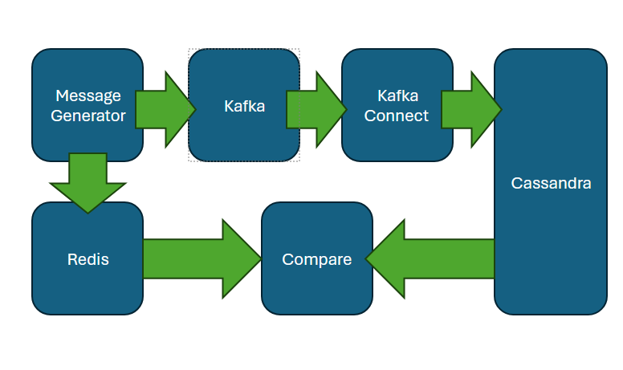
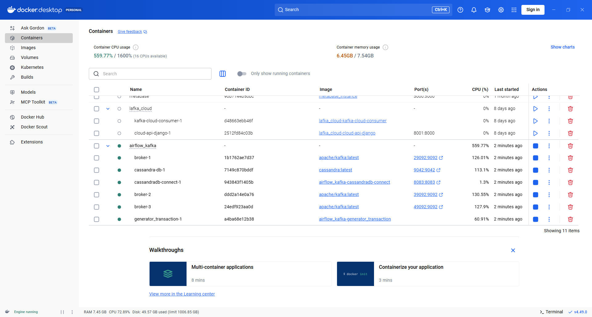
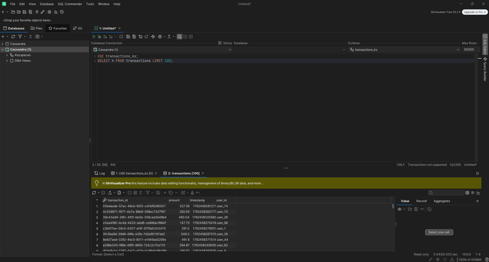
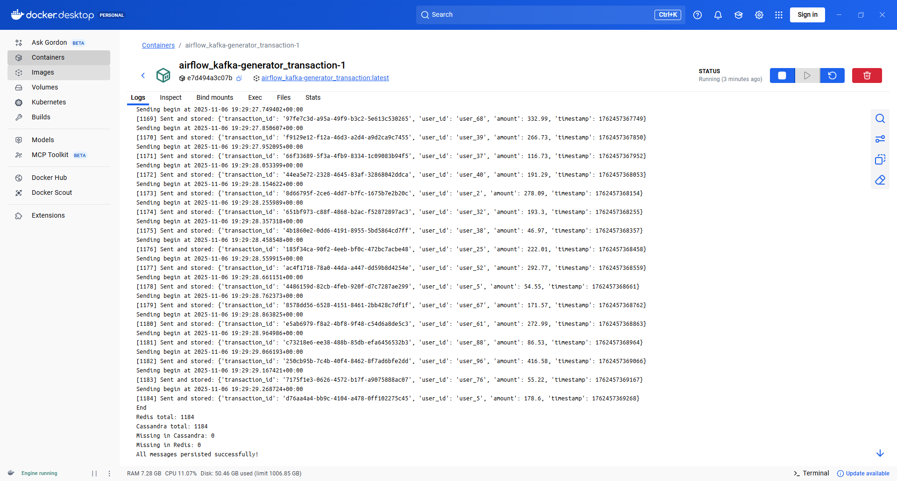

## Intorduction

The purpose of this paper is to evaluate the Kafka Messaging Broker in terms of its two advantages: scalability and resilience to broker instance failures. These are the main advantages of Kafka, which make it more efficient and easier to implement than brokers such as RabbitMQ or ActiveMQ.

To achieve this, a container cluster was created in Docker-Compose, containing: - Generator - Kafka broker - three hosts with three instances - Kafka Connect - Cassandra Sink - Cassandra database - Host with Redis cache (only for Kafka performance verification)

It works by broadcasting messages from a generator, which are then sent to Kafka Connect via Kafka and written to the Cassandra database. For later verification, the generated messages are simultaneously written to the host running Redis.

Sustainability verification involves running a .sh script that starts the cluster and then shuts down one of the brokers. After broadcasting, the number of messages in Redis will be compared with the number of messages in Cassandra. Additionally, load tests will be conducted to demonstrate Kafka's horizontal scaling, with the loggers handling individual partitions under hardware load while broadcasting messages to a topic.

The cluster code is located in the following repository:

[GitHub Repo](https://github.com/wojciechfpga/kafka_scalability)

## 1. Demonstration project

To verify Kafka's fault tolerance and scalability, a cluster of hosts must be developed, which includes a data generator that writes messages to a Kafka topic and to Redis. Another element is at least three Kafka brokers to establish quorum to determine whether messages in a topic are valid after the loss of one host. A Zookeeper metadata server, although this can be replaced by an additional controller function on one or more hosts, and Kafka Connect to receive messages from a Kafka topic and write them to Cassandra. A diagram of this message flow is shown below:

 Below is a shortened code in docker-compose that implements the above architecture in a cluster.

```{python}
#| eval: false
#| include: true
services:
  generator_transaction:
    build: ./generator_transactions
    command: bash -c "bash begin.sh || true; tail -f /dev/null"
    volumes:
      - ./generator_transactions:/app
    depends_on:
          ...
  cassandra-db:
    image: cassandra:latest
    ports:
      - 9042:9042
    environment:
      ...
    #volumes:
      #- cassandra_data:/var/lib/cassandra
    healthcheck:
          ...

  cassandradb-connect:
    build: ./connector
    ports:
      - 8083:8083
    environment:
      ...
    depends_on:
      - broker-1
      - cassandra-db
    healthcheck:
      ...

  broker-1:
    image: apache/kafka:latest
    container_name: broker-1
    ports:
      - 29092:9092
    environment:
      ...
    healthcheck:
      ...

  broker-2:
    image: apache/kafka:latest
    container_name: broker-2
    ports:
      - 39092:9092
    environment:
      ...
    depends_on:
          broker-1:
            condition: service_healthy

  broker-3:
    image: apache/kafka:latest
    container_name: broker-3
    ports:
      - 49092:9092
    environment:
     ...
    depends_on:
          broker-1:
            condition: service_healthy

  redis:
    image: redis:7
    container_name: redis
    ports:
      - "6379:6379"
    command: ["redis-server", "--save", "", "--appendonly", "no"] 
    healthcheck:
      ...

#volumes:
 # cassandra_data:

```

The above cluster can be started with the cluster.sh script, which also shuts down one of the Kafka brokers to verify fault tolerance.

```{python}
#| eval: false
#| include: true
echo "Starting the cluster..."
docker-compose up --build -d

echo "Waiting for the generator_transaction container to start..."

while true; do
  STATUS=$(docker inspect -f '{{.State.Running}}' $(docker-compose ps -q generator_transaction) 2>/dev/null)
  if [ "$STATUS" == "true" ]; then
    echo "The generator_transaction container is running."
    break
  fi
  sleep 2
done

echo "Waiting for 50 seconds..."
sleep 50

echo "Forcefully stopping the broker-2 container..."
docker kill $(docker-compose ps -q broker-2)

echo "Done."

```

### 1.1. Generator/comparator host

The generator container contains several Python scripts, including the begin.sh script, which runs the message. The purpose of each script is to prepare the remaining components to accept messages and start the message generation process.

### 1.2. Kafka Connect - Cassandra sink host

One necessary process is configuring Kafka Connect to work with Kafka brokers and the Cassandra database. This is accomplished by sending configuration JSON to the appropriate URL. The sent configuration JSON is shown below:

```{python}
#| eval: false
#| include: true
{
  "name": "cassandra-sink-connector",
  "config": {
    "connector.class": "io.confluent.connect.cassandra.CassandraSinkConnector",
    "tasks.max": "1",
    "topics": "transactions",
    "cassandra.contact.points": "cassandra-db",
    "cassandra.port": "9042",
    "cassandra.keyspace": "transactions_ks",
    "cassandra.local.datacenter": "DC1",
    "cassandra.consistency.level": "LOCAL_ONE",
    "cassandra.username": "",
    "cassandra.password": "",
    "key.converter": "org.apache.kafka.connect.json.JsonConverter",
    "key.converter.schemas.enable": "false",
    "value.converter": "org.apache.kafka.connect.json.JsonConverter",
    "value.converter.schemas.enable": "false",
    "cassandra.table.name.format": "${topic}",
    "insert.mode": "insert",
    "confluent.topic.bootstrap.servers": "broker-1:19092,broker-2:19092,broker-3:19092"
  }
}

```

## 2. Kafka Scalability - Multiple Partitions and Brokers

To demonstrate Kafka's scalability - handling different partitions of a given topic by different hosts - you need to properly configure the topic to which messages will be sent and set, for example, three partitions.

```{python}
#| eval: false
#| include: true
from kafka.admin import KafkaAdminClient, NewTopic
from datetime import datetime

admin_client = KafkaAdminClient(
    bootstrap_servers = "broker-1:19092,broker-2:19092,broker-3:19092",
    client_id = "admin_config"
)

topic = NewTopic(
    name = "transactions",
    num_partitions=3,
    replication_factor=3  
)

admin_client.create_topics(new_topics=[topic], validate_only=False)
now = datetime.now()
print(f"Kafka Topic created {now}")
```

Next, it is necessary to develop the Kafka producer code that sends messages to the previously created topic.

```{python}
#| eval: false
#| include: true
from kafka import KafkaProducer
import redis
import json, time, uuid, random, datetime

producer = KafkaProducer(
    bootstrap_servers="broker-1:19092,broker-2:19092,broker-3:19092",
    value_serializer=lambda v: json.dumps(v, default=str).encode("utf-8"),
    acks='all', 
    retries=5
)

r = redis.Redis(host='redis', port=6379, db=0)

start_time = time.time()
duration = 120
counter = 0

while time.time() - start_time < duration:
    now = datetime.datetime.now(datetime.timezone.utc)
    print(f"Sending begin at {now}")
    msg = {
        "transaction_id": str(uuid.uuid4()),
        "user_id": f"user_{random.randint(1,100)}",
        "amount": round(random.uniform(10.0, 500.0), 2),
        "timestamp": int(now.timestamp() * 1000)
    }

    future = producer.send(
        "transactions",
        key=json.dumps({"transaction_id": msg["transaction_id"]}).encode("utf-8"),
        value=msg
    )

    try:
        record_metadata = future.get(timeout=20)
        r.set(msg["transaction_id"], json.dumps(msg))
        counter += 1
        print(f"[{counter}] Sent and stored:", msg)
    except Exception as e:
        print("Error sending to Kafka:", e)

    time.sleep(0.0001)

producer.flush()
producer.close()
print("End")

```

With the data architecture cluster elements already in place, you can see how—despite creating a single topic with three partitions—the load is distributed across three hosts serving the topic in three partitions. The figure below clearly shows that the hosts with brokers handling partitions and replicas are under heavy load, demonstrating that horizontal scalability has been achieved in Kafka.



## 3. Broker fault tolerance - data replicas across multiple brokers

The purpose of this chapter is to demonstrate Kafka's resilience to broker failures through its replication mechanism. This replication mechanism is ensured by a proper declaration when creating a topic, as seen in the following code:

```{python}
#| eval: false
#| include: true
topic = NewTopic(
    name = "transactions",
    num_partitions=3,
    replication_factor=3  
)
```

Once the cluster is up and running, one of the brokers—broker-2—can be forcibly shut down, simulating a server failure. This will result in a series of logs appearing on other Kafka brokers, indicating the event.

The most important ones are listed below.

The first exception thrown is when broker-1 loses connection to broker-2:

```{python}
#| eval: false
#| include: true
java.io.IOException: Connection to broker-2:19092 (id: 2 rack: null isFenced: false) failed.
```

Then the connection closure is confirmed:

```{python}
#| eval: false
#| include: true
Client requested connection close from node 2 (org.apache.kafka.clients.NetworkClient)
```

To ensure data replication, broker-1 sends fetch request messages to broker-2. In this case, the client reports an error that it is not sending a fetch request to receive data for replication because broker-2 is no longer available.

```{python}
#| eval: false
#| include: true
Error sending fetch request (sessionId=700883982, epoch=INITIAL) to node 2:
```

The next log indicates that broker-1 stopped fetching data from broker-2. The fact that broker-1 was fetching data and then stopped doing so indicates that broker-2, which was shut down, was the partition leader.

```{python}
#| eval: false
#| include: true
Removed fetcher for partitions Set(_confluent-command-0, transactions-0)
```

Next, a new partition leader is elected, from which other brokers with partition replicas will fetch data for replication. Broker-3 was chosen as the new leader, and fetch requests will be sent to it for partition replication.

```{python}
#| eval: false
#| include: true
Added fetcher to broker 3 for partitions HashMap(transactions-1 -> InitialFetchState(... BrokerEndPoint(id=3, host=broker-3:19092),1,157))
```

Then, a confirmation is received in the logs that the process responsible for data replication from broker-2 has been closed - so as not to try to download data from broker-2, which is not available.

```{python}
#| eval: false
#| include: true
ReplicaFetcherThread-0-2: Shutting down ... Shutdown completed
```

Next, the number of messages written to Redis and stored in Cassandra is verified. It's clear that the numbers match. This means that despite a broker failure, all messages were delivered to Kafka Connect and stored in Cassandra. The figure below shows sample data stored in Cassandra - in DbVisualizer.



In order to verify the amount of data stored in Redis and Cassandra, a special Python script was developed, as shown below:

```{python}
#| eval: false
#| include: true
from cassandra.cluster import Cluster
import redis, json

cluster = Cluster(['cassandra-db'])
session = cluster.connect('transactions_ks')

r = redis.Redis(host='redis', port=6379, db=0)


keys = r.keys('*')
redis_data = {k.decode(): json.loads(r.get(k)) for k in keys}

rows = session.execute("SELECT transaction_id, user_id, amount, timestamp FROM transactions")
cassandra_data = {row.transaction_id: {
    "transaction_id": row.transaction_id,
    "user_id": row.user_id,
    "amount": row.amount,
    "timestamp": row.timestamp
} for row in rows}

missing_in_cassandra = set(redis_data.keys()) - set(cassandra_data.keys())
missing_in_redis = set(cassandra_data.keys()) - set(redis_data.keys())

print(f"Redis total: {len(redis_data)}")
print(f"Cassandra total: {len(cassandra_data)}")
print(f"Missing in Cassandra: {len(missing_in_cassandra)}")
print(f"Missing in Redis: {len(missing_in_redis)}")

if missing_in_cassandra:
    print("Not in Cassandra:", list(missing_in_cassandra)[:10])
else:
    print("All messages persisted successfully!")

```

The screenshot below shows that the script executed correctly and the data in Redi and Cassandra matches, confirming that all messages reached Kafka Connect despite the broker failure.



## 4. Summary

Creating a topic with multiple partitions enabled us to leverage one of Kafka's greatest advantages: scalability. Including a large message stream in a topic with three partitions resulted in a strong and even load on all three hosts with Kafka brokers.

A sudden interruption of the broker—serving a specific partition—did not result in message loss thanks to the replication mechanism, which should be specified when declaring the Kafka topic.

Kafka met the requirements, but if the number of hosts in the cluster is limited, consider using inter-cluster Kafka replication, such as Mirror Maker 2.
