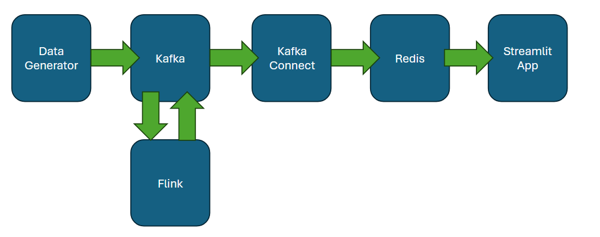
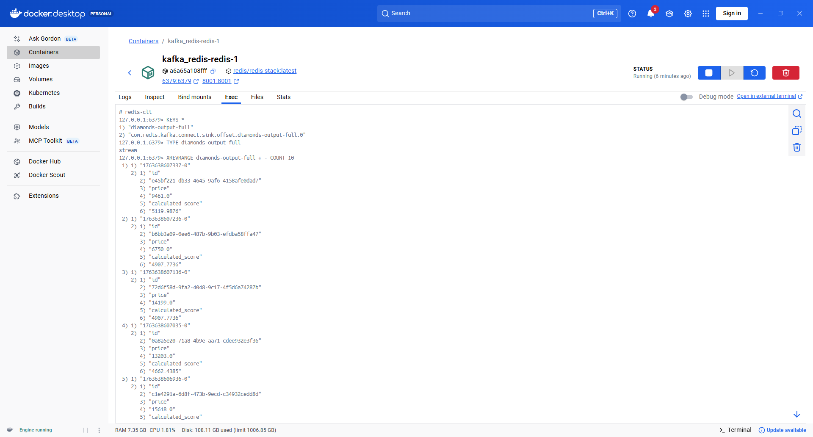
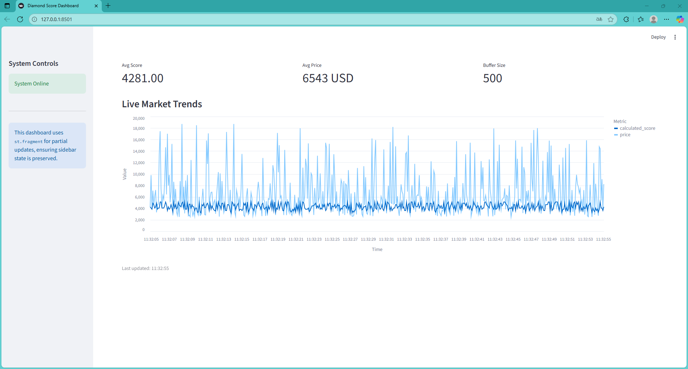

## Introduction

The main goal of this project is to create an interactive dashboard illustrating the difference between the average price of diamond production costs (which remains constant for each diamond) and the average market value of diamonds sold. This will allow for observing trends in the diamond market.

A decision tree, whose parameters will be calculated using the scikit-learn package, will be used to determine the market value of diamonds.

Data regarding current diamond sales will be generated using a Python script generator. This data will be transmitted using Kafka and sent to Flink. Flink will calculate the market value using a Scala implementation of the decision tree. Kafka will then suggest prices for individual diamonds to a new Kafka topic. The data will then be sent to Kafka Connect - Redis Sink, which will store it in Redis. The data from Redis will be read by a Python script implementing the Real-Time Dashboard.

Code:

[GitHub Repo](https://github.com/wojciechfpga/diamonds_kafka_redis_streamlit_dashboard)

## 1. Data architecture design

The data architecture discussed in the introduction is presented in the figure below:

 
It's worth noting that some components contain more than one host. For example, Flink requires a client to generate a job graph, a jobmanager to manage clusters, and a taskmanager to execute tasks—all on separate hosts within the cluster.

Below is a shorthand version of the code implementing the architecture in Docker-Compose:

```{python}
#| eval: false
#| include: true
services:
  message-generator:
    build: ./message-generator
    ...

  flink-jobmanager:
    build: ./flink-app
    ...

  flink-taskmanager:
    build: ./flink-app
    ...

  broker-1:
    image: apache/kafka:latest
    container_name: broker-1
    ports:
      - 29092:9092
    ...

  job-submitter:
    build: ./flink-app
    ...

  schema-registry:
    image: confluentinc/cp-schema-registry:latest
    depends_on:
      - broker-1
    ...

  redis:
    image: redis/redis-stack:latest
    ports:
      - "6379:6379"
      - "8001:8001"

  kafka-connect:
    build: ./kafka-connect-redis
    ...


  configurator:
    build: ./configurator
    ...

  streamlit-dashboard:
    build: ./streamlit-dashboard
    depends_on:
      - redis
    ...

```

It's worth mentioning that there are hosts with auxiliary elements, such as Schema Registry. This allows for easy schema management and minimizes code changes when the structure of the transferred data changes.

## 2. Data generator

The main task of the data generator is to generate diamond parameters, its base price (based on the Diamonds dataset from Seaborn/ggplot2), and its sales volume. This data is saved to the appropriate Kafka topic. Before the message generation process begins, a Kafka broker is configured and the topic is created.

Below is the most important part of the generator code:

```{python}
#| eval: false
#| include: true
import time
from data_generator import diamond_data_generator
from producer import send_diamond_event, close_producer


if __name__ == "__main__":
    print("Starting continuous generation and sending of diamond events to Kafka...")

    generator = diamond_data_generator()

    try:
        while True:
            event = next(generator)
            send_diamond_event(event)

            print(f"Sent event (ID: {event['id'][:8]}..., Carat: {event['carat']:.2f})")

            time.sleep(0.1)

    except KeyboardInterrupt:
        print("\nGenerator stopped by user.")

    finally:
        close_producer()

```

## 3. Kafka broker

The Kafka broker in the project is configured using environment variables defined in Docker-Compose. This broker has two threads: one with diamond parameters and sales volume. The producer is the data generator discussed in the previous section. The second thread contains basic diamond parameters, including the ID and a suggested price based on sales volume. Data from this second thread is sent via Kafka Sink from Flink to Kafka Connect, which stores it in Redis.

Data from and to Kafka will be transferred in Avro format.

Replication and scalability mechanism was not implemented - multiple partitions for each topic, numerous broker instances - the topic of scalability and replication was discussed in a separate paper.

## 4. Flink

Flink's main task is to calculate the market value of a diamond based on its sales volume. To accomplish this, a DataStream object was created based on the Kafka Source with a topic from the data generator. Then, using mapping and a function call, a modified DataStream object was created, which was then written to the appropriate Kafka topic using the Flink Kafka Sink. This is demonstrated in the following code:

```{python}
#| eval: false
#| include: true
object FlinkDiamondJob {
  def main(args: Array[String]): Unit = {
    val env = StreamExecutionEnvironment.getExecutionEnvironment
    // env.setParallelism(1) 

    val source = KafkaSource.builder[Diamond]()
      .setBootstrapServers(adressBroker)
      .setTopics(inputTopic)
      .setGroupId(idOfInputGroup)
      .setStartingOffsets(OffsetsInitializer.latest())
      .setValueOnlyDeserializer(new DiamondAvroDeserializer(schemaRegistryUrl))
      .build()

    val inputStream: DataStream[Diamond] = env.fromSource(
      source,
      WatermarkStrategy.noWatermarks[Diamond](),
      "kafka-source-diamonds"
    )

    implicit val avroTypeInfo: TypeInformation[GenericRecord] = 
      new GenericRecordAvroTypeInfo(OutputSchema.DiamondScore)

    val outputStream: DataStream[GenericRecord] = inputStream
      .map { diamond =>
        val pre = DiamondPreprocessor.preprocess(diamond)
        val score = DiamondPriceTreePredictor.predict(pre)

        val record = new GenericData.Record(OutputSchema.DiamondScore)
        record.put("id", diamond.id)
        record.put("price", diamond.price)
        record.put("calculated_score", score)
        
        record.asInstanceOf[GenericRecord] 
      } 
      .name(kafkaOutStreamName)

    val sink: KafkaSink[GenericRecord] = KafkaSink.builder[GenericRecord]()
      .setBootstrapServers(adressBroker)
      .setRecordSerializer(
        KafkaRecordSerializationSchema.builder[GenericRecord]()
          .setTopic(outputTopic)
          .setValueSerializationSchema(
            ConfluentRegistryAvroSerializationSchema.forGeneric(
              s"$outputTopic-value",
              OutputSchema.DiamondScore,
              schemaRegistryUrl
            )
          )
          .build()
      )
      .build()

    outputStream
      .sinkTo(sink)
      .name(kafkaSinkName)

    env.execute("Flink Diamond Price Prediction Job")
  }
}
```

The code above shows that a function has been implemented to calculate the suggested value—calculated_score—using a decision tree. The decision tree parameters and data transformations were calculated in the following notebook using the scikit-learn package (DecisionTreeRegressor class), and then the resulting decision tree and transformations were ported to Scala. Link to the notebook:

[Notebook - Python - scikit-learn](https://github.com/wojciechfpga/decison_tree_parameters_for_flink/blob/main/FlinkDecisonTreeCalculation.ipynb)

The resulting decision tree structure was implemented in the Scala language.

## 5. Kafka Connect - Redis Sink

Kafka Connect is used to write data from a Kafka topic to Redis. For it to work correctly, an HTTP POST message with the following dictionary (as JSON) attached must be sent to the appropriate URL (specifying the port and URI):

```{python}
#| eval: false
#| include: true
payload = {
  "name": CONNECTOR_NAME,
  "config": {
    "connector.class": "com.redis.kafka.connect.RedisSinkConnector",
    "topics": "diamonds-output-full",
    "redis.uri": "redis://redis:6379", 
    "redis.type": "JSON",           
    "redis.keyspace": "diament",    
    "key.converter": "org.apache.kafka.connect.storage.StringConverter",
    "value.converter": "io.confluent.connect.avro.AvroConverter",
    "value.converter.schema.registry.url": "http://schema-registry:8081",
    "value.converter.schemas.enable": "true",
    "transforms": "createKey,extractString", 
    "transforms.createKey.type": "org.apache.kafka.connect.transforms.ValueToKey",
    "transforms.createKey.fields": "id",
    "transforms.extractString.type": "org.apache.kafka.connect.transforms.ExtractField$Key",
    "transforms.extractString.field": "id"
  }
}
```

The container containing the Kafka Connect - Redis Sink is created based on the following Dockerfile:

```{python}
#| eval: false
#| include: true
FROM confluentinc/cp-kafka-connect:latest

RUN confluent-hub install --no-prompt redis/redis-kafka-connect:latest
```

The basis for creating a container is the Confluent Kafka Connect base image. It includes basic Confluent plugins.

Then the confluent-hub install command in the base container's CLI is run, which installs Redis support into the container with Kafka Connect.

## 5. Redis

The main purpose of Redis is to store data about diamonds and their scores for quick access by applications such as Streamplit. Below are the parameters for storing data using the Redis-CLI:

 

It is visible that the data type is stream and sample data stored regarding diamond sales.

## 6. Streamlit App

A real-time dashboard—refreshed every two seconds for demonstration purposes—was created using the Streamlit Python library. Below is a screenshot of the dashboard:

 

Main app code is belowe:

```{python}
#| eval: false
#| include: true
from config.settings import setup_page
from dashboard.layout import render_sidebar
from dashboard.live_dashboard import render_live_dashboard

setup_page()

render_sidebar()

render_live_dashboard()

```

It is clearly visible that the application consists of three modules that run one after the other. Most important is call the dashboard:

```{python}
#| eval: false
#| include: true
import time
import pandas as pd
import streamlit as st
import altair as alt

from data.stream_loader import load_stream


@st.fragment(run_every="2s")
def render_live_dashboard():
    """Main real-time dashboard fragment."""

    df = load_stream()

    if df.empty:
        st.warning("Waiting for data stream from Flink...")
        return

    with st.container():
        col1, col2, col3 = st.columns(3)
        col1.metric("Avg Score", f"{df['calculated_score'].mean():.2f}")
        col2.metric("Avg Price", f"{df['price'].mean():.0f} USD")
        col3.metric("Buffer Size", len(df))

    st.subheader("Live Market Trends")

    columns_to_drop = ['id', 'timestamp']
    df_for_chart = df.drop(columns=columns_to_drop, errors='ignore')

    chart_data = df_for_chart.melt(
        "datetime",
        var_name="Metric",
        value_name="Value",
    )

    chart = (
        alt.Chart(chart_data)
        .mark_line()
        .encode(
            x=alt.X("datetime", axis=alt.Axis(format="%H:%M:%S", title="Time")),
            y=alt.Y("Value", title="Value"),
            color="Metric",
        )
        .properties(height=400)
    )

    st.altair_chart(chart, use_container_width=True)

    st.caption(f"Last updated: {time.strftime('%H:%M:%S')}")
```

Below is a video showing how the dashboard works:

[YouTube Video](https://www.youtube.com/watch?v=g6xEwJg_Kqs)

## 7. Summary

An analytical dashboard was created based on a Kafka data stream, which is modified using Flink. It allows for easy viewing of the difference between a diamond's base value—the production value—and the market price resulting from increased demand. This allows for easy observation of what's happening in the diamond market, how expensive diamonds are on the market, and what their market value is, allowing for appropriate investment management.

The Redis container allows for quick information on valuation data for individual diamonds—how their market value is changing, which is critical in applications requiring quick access to valuations where every second is crucial. Therefore, the Redis container with market score valuations can be used in automatic price recommendation systems or in stock trading.
