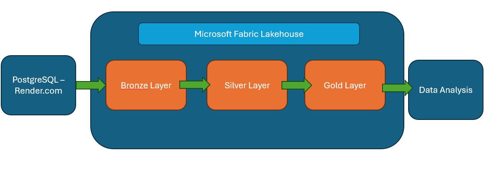
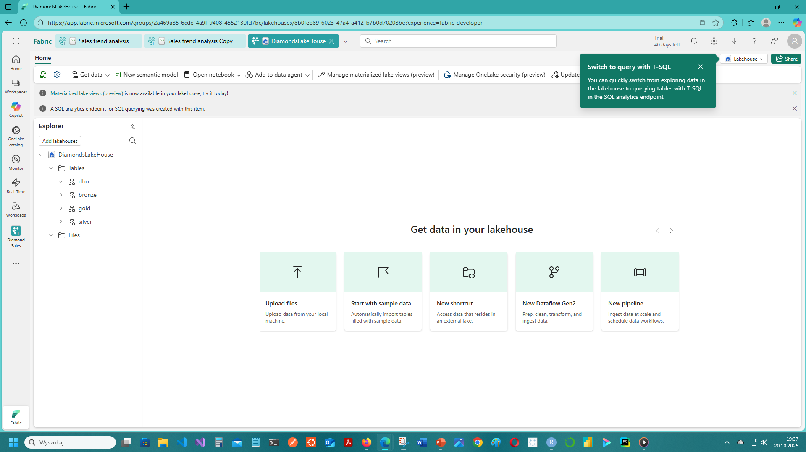
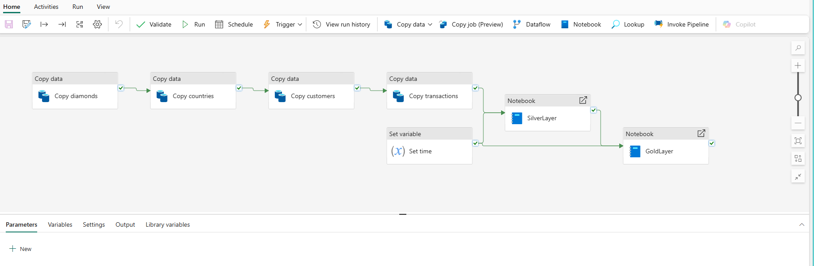
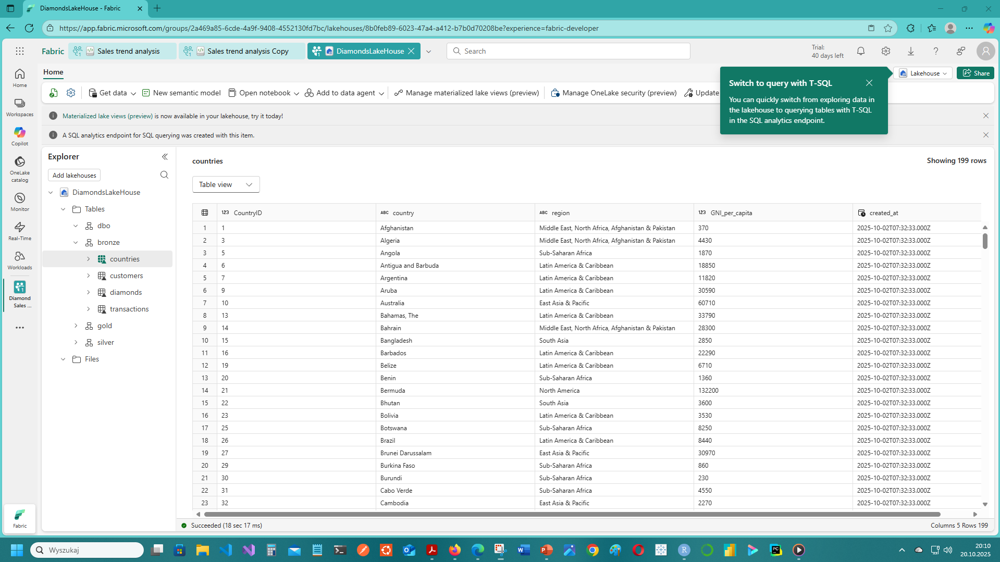
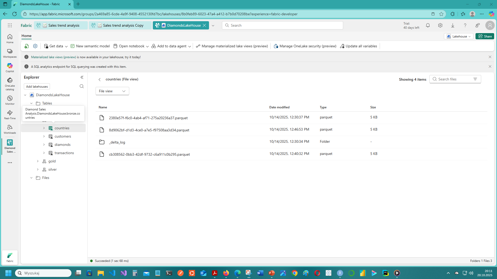

## Introduction

This study created a lakehouse solution based on the Microsoft Fabric cloud.

The project's goal was to develop a platform that could accommodate both unstructured and structured data.

To verify its feasibility, the developed lakehouse was populated with data from a PostgreSQL database. This data was generated in an R script and forms a database for a fictitious company involved in the global diamond trade. This data is based on transaction data, specifying individual transactions concluded with specific users. Data regarding users, their countries of origin, and the diamonds (the Diamonds collection) were also stored in this database.

## 1. The Lakehouse platform project that acquires data via the ELT pipeline

Lakehouse is a solution that combines the advantages and functionalities of a data lake and a data warehouse. Lakehouse can store all types of files (as in a data lake). Similar to data warehousing, Lakehouse can create data tables supported by SQL, but based on Delta Lake files.

The data flow in the lakehouse is similar to that of a data warehouse and is referred to as a medallion architecture. Raw data is placed in the bronze tier, cleansed in the silver tier, and analysis-ready data is placed in the gold tier.

To address these requirements, a solution based on Fabric Lakehouse was developed. It will ingest data from an external source—a PostgreSQL database on the Render.com cloud—into the lakehouse using Data Factory. Transformations will then be implemented using Data Factory to place the analysis-ready data in the gold tier.

## 2. Microsoft Fabric Lakehouse - instance

The first steps were to create a Fabric workspace and create a Lakehouse instance.

## 3. Microsoft Fabric Data Factory Pipeline

Next, a Data Factory Pipeline was created. The first step was to copy data from the PostgreSQL database to the bronze tier. To avoid duplication, SQL queries were designed to retrieve data from before the scheduler period. The data was then transformed to the silver tier and then to the gold tier. This was accomplished using notebooks within the pipeline. A time variable was used in both of the last two steps to prevent duplication.

The notebook code can be found here:

[Silver Layer notebook](https://github.com/wojciechfpga/LakehouseDataFactoryNotebooks/blob/main/silver_layer.ipynb)

[Gold Layer notebook](https://github.com/wojciechfpga/LakehouseDataFactoryNotebooks/blob/main/gold_layer.ipynb)

## 4. Lakehouse tables data overview

After copying the data to the lakehouse, it is available in individual tables - the schema name corresponds to the medallion architecture layer.

Lakehouse tables are based on Delta Lake files. Delta Lake files are an extension of the Parquet format. In addition to Parquet files containing data, they also store JSON files—transaction logs and, optionally, checkpoints—to describe how the data has changed. This gives the Delta Lake format significant advantages over Parquet, including support for ACID transactions and the ability to read the data history in tables.

## 5. Example data analysis using SparkR

To practically test the capabilities of the developed Lakehouse, a data analysis was conducted using data from the gold layer. The goal of the analysis was to compare the demand for specific diamonds in Israel and Italy. Using SparkR, distributed computations were implemented for acceleration.

[Data Analysis notebook](https://github.com/wojciechfpga/LakehouseDataAnalysis/blob/main/israel_italy_diamonds_analysis.ipynb)

## 6. Summary

- A lakehouse platform was developed, enabling the storage of unstructured data (such as a data lake) and structured data (such as a data warehouse) as delta lake files.

- The Data Factory tool enabled the implementation of the Medallion architecture using Python in PySpark notebooks, making it easy to review and debug the code.

- Spark enabled rapid analysis on large data sets, but visualization often requires working with common, non-distributed data structures, which requires code optimization.

- The analysis resulted in specific recommendations derived from data obtained after numerous transformations in SparkR. Therefore, using SparkR—and Spark in general—enables inference on massive data sets.
