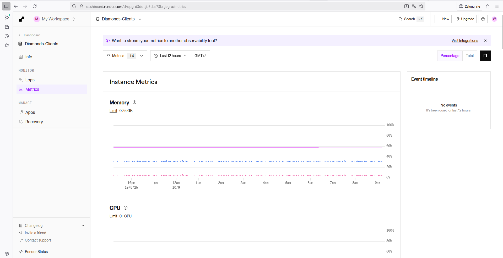
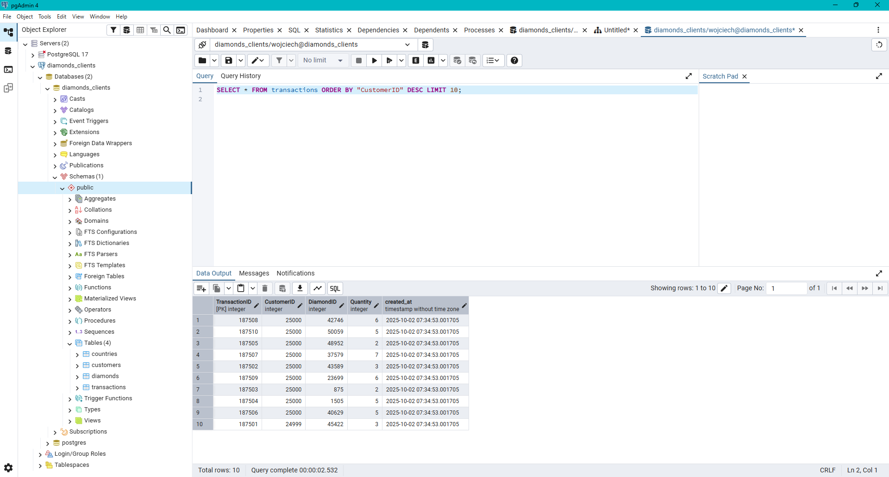
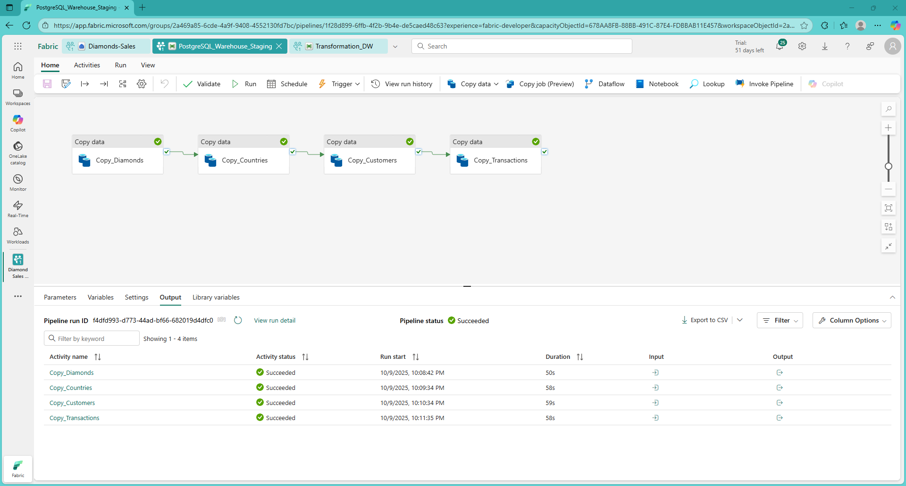
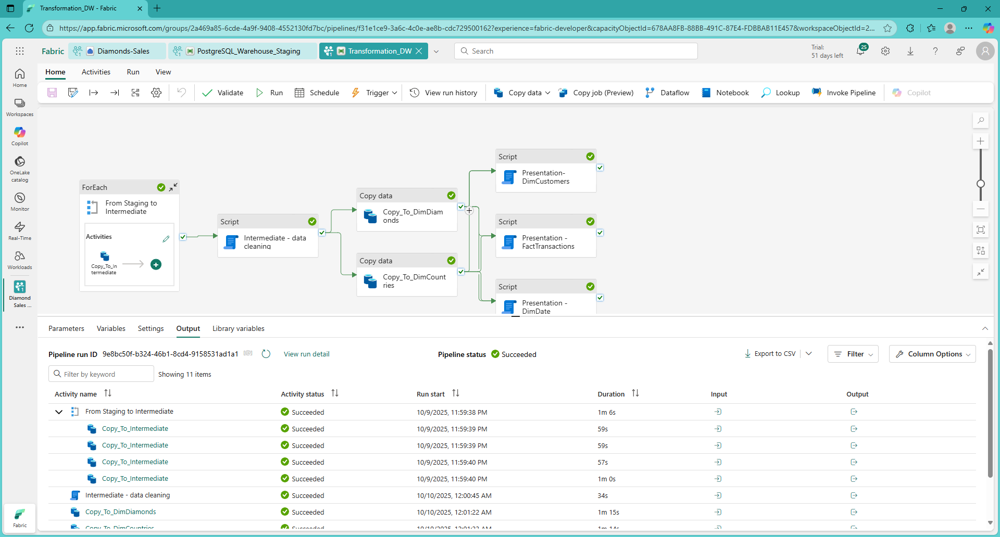
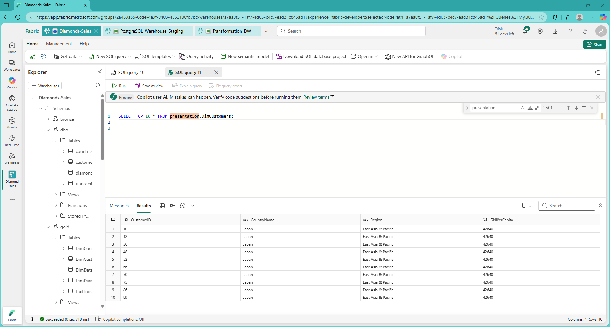
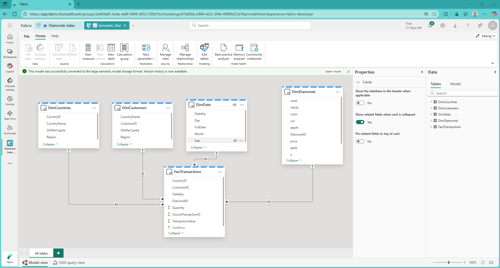
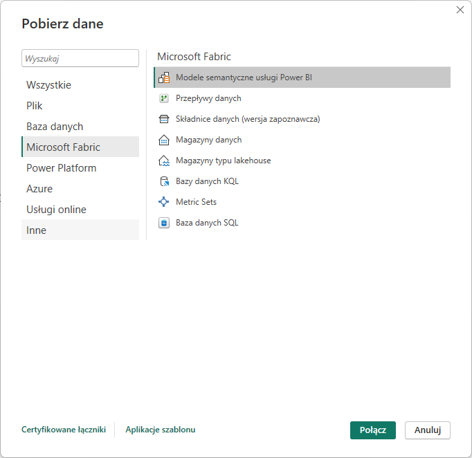
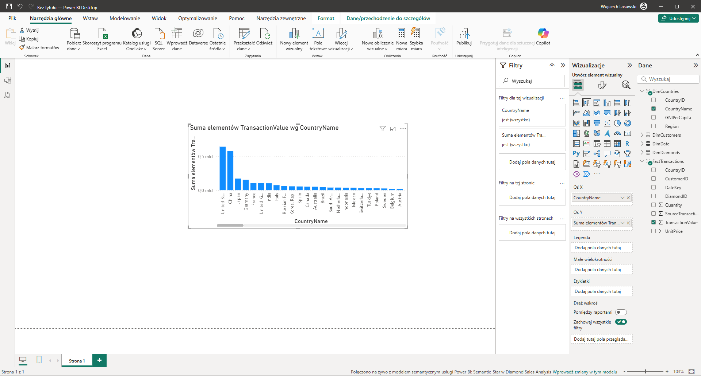
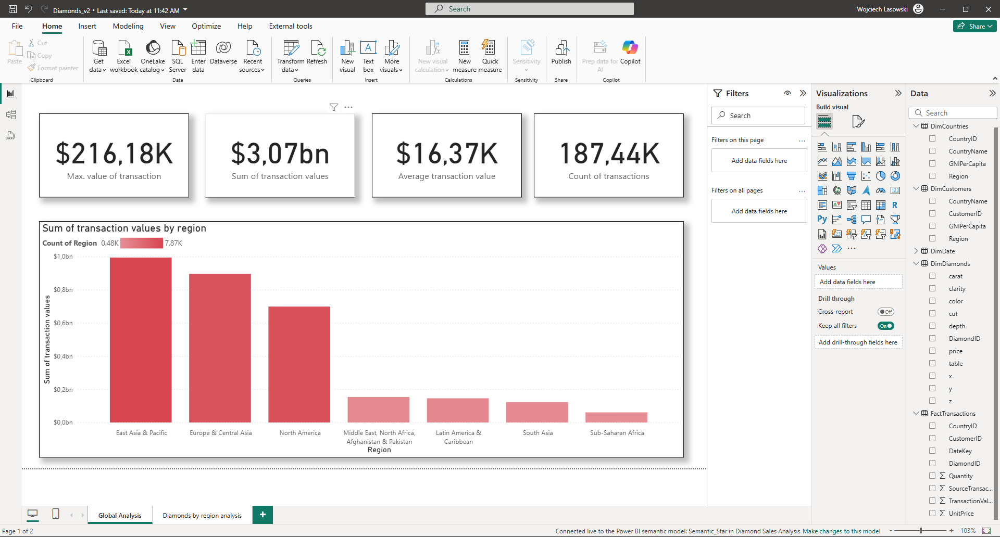
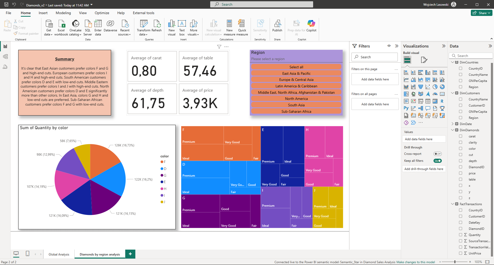

## Introduction

The goal of this project is to develop a data warehouse that combines data from multiple sources to provide analytical data for a fictional diamond trading company. Data sources in this architecture are typically relational databases—typically web application databases. For simplicity, this project will utilize a single data source: an OLTP PostgreSQL database hosted in the Render.com cloud. This database will contain a range of data typical of a web application for an online diamond store. However, due to the complexity of the diamond trading problem, this data has been simplified. This data was generated using a series of R scripts.

## 1. ELT pipeline project

Data warehouses shouldn't be fed directly, but rather through processes that transfer data from sources such as application databases to the data warehouse. These processes are referred to as ETL and ELT. Due to the lack of a data transformation subsystem—which simplifies the system—the ELT process will be used, which transforms data in the warehouse.

As a result of the ELT pipeline – part of EL – data is placed in the data warehouse, specifically in the staging layer. In this paper, a pipeline will be created for this purpose using Data Factory.

The data is then transformed in the data warehouse in the intermediate and presentation layers. A separate pipeline will be created in Data Factory for this purpose.

The above processes are illustrated in the diagram below.

```{mermaid}
flowchart LR

classDef default fill:#ffffff,stroke:#000,stroke-width:1px,color:#000,rx:10,ry:10;

subgraph Sources["Data Sources"]
  A1["OLTP DB"]
  A2["Files / Streams"]
end

subgraph Staging["Staging Layer"]
  B1["Raw & Ingested Data"]
end

subgraph Intermediate["Intermediate Layer"]
  S1["Validated & Transformed Data"]
end

subgraph Presentation["Presentation Layer"]
  G1["Business-Ready / Analytical Data"]
end

subgraph Outputs["Data Consumers"]
  D1["BI Tools"]
  D2["ML Models"]
end

style Sources fill:#ffffff,stroke:#000,color:#000,stroke-width:1px;
style Staging fill:#ffffff,stroke:#000,color:#000,stroke-width:1px;
style Intermediate fill:#ffffff,stroke:#000,color:#000,stroke-width:1px;
style Presentation fill:#ffffff,stroke:#000,color:#000,stroke-width:1px;
style Outputs fill:#ffffff,stroke:#000,color:#000,stroke-width:1px;

A1 --> B1
A2 --> B1
B1 --> S1 --> G1
G1 --> D1
G1 --> D2
```

To sum up - two pipelines will be created in Data Factory - one corresponding to the EL part - for data transfer and the other for data transformation in the warehouse - corresponding to the "T" process of the ELT pipeline.

## 2. Data migration to PostgreSQL in the Render.com Cloud

The first step of the task is to generate data using scripts and place it in a database accessible by MS Fabric. This will be accomplished using a PostgreSQL database hosted on the Render.com platform.

### 2.1. Create a PostgreSQL instance on the Render.com Cloud

A PostgreSQL database can be easily installed on PostgreSQL servers, even in the free version. The Render.com platform provides an administration panel for monitoring database status and other functionalities, but SQL queries must be executed from a separate environment.




### 2.2 Create a database structure using the DBI package

The generated data fits the database design defined by the ERD diagram below.


To populate the database with sample data, you need to use a number of R libraries.

```{r}
#| eval: false
#| include: true
library(DBI)
library(RPostgres)
library(readr)
```

Then, an instance of the database connection is created.

```{r}
#| eval: false
#| include: true
con <- dbConnect(
  RPostgres::Postgres(),
  dbname = "diamonds_clients",
  host = "secret-a.frankfurt-postgres.render.com",
  port = 5432,
  user = "wojciech",
  password = "secret"
)
```

Then, using subsequent calls to the dbExecute function, subsequent SQL commands are executed in the database, creating tables according to the adopted design (ERD diagram).

```{r}
#| eval: false
#| include: true
dbExecute(con, '
  CREATE TABLE "customers" (
    "CustomerID" INTEGER PRIMARY KEY,
    "CountryID" INTEGER,
    "created_at" TIMESTAMP DEFAULT CURRENT_TIMESTAMP,
    FOREIGN KEY("CountryID") REFERENCES countries("CountryID")
  );
')
```

```{r}
#| eval: false
#| include: true
dbExecute(con, '
  CREATE TABLE "diamonds" (
    "DiamondID" INTEGER PRIMARY KEY,
    "carat" DOUBLE PRECISION,
    "cut" TEXT,
    "color" TEXT,
    "clarity" TEXT,
    "depth" DOUBLE PRECISION,
    "table" DOUBLE PRECISION,
    "price" INTEGER,
    "x" DOUBLE PRECISION,
    "y" DOUBLE PRECISION,
    "z" DOUBLE PRECISION,
    "created_at" TIMESTAMP DEFAULT CURRENT_TIMESTAMP
  );
')
```


```{r}
#| eval: false
#| include: true
dbExecute(con, '
  CREATE TABLE "transactions" (
    "TransactionID" INTEGER PRIMARY KEY,
    "CustomerID" INTEGER REFERENCES "customers"("CustomerID"),
    "DiamondID" INTEGER REFERENCES "diamonds"("DiamondID"),
    "Quantity" INTEGER,
    "created_at" TIMESTAMP DEFAULT CURRENT_TIMESTAMP
  );
')
```


```{r}
#| eval: false
#| include: true
dbExecute(con, '
  CREATE TABLE "countries" (
    "CountryID" INTEGER PRIMARY KEY,
    "country" TEXT,
    "region" TEXT,
    "GNI_per_capita" INTEGER,
    "created_at" TIMESTAMP DEFAULT CURRENT_TIMESTAMP
  );
')
```

As a result of executing a series of rather extensive SQL scripts, the countries_df, customers_df, and transactions_df data frames were created, which will be written to the appropriate tables using the dbWriteTable function. In addition, the standard Diamonds data set will be written to the database in the form of diamonds_df.

```{r}
#| eval: false
#| include: true
dbWriteTable(con, "countries", countries_df, append = TRUE)
dbWriteTable(con, "customers", customers_df, append = TRUE)
dbWriteTable(con, "diamonds", diamonds_df, append = TRUE)
dbWriteTable(con, "transactions", transactions_df, append = TRUE)
```

Using the PgAdmin program, you can - after entering the connection string - query previously created and filled tables.



### 2.3. Preparing a Data Warehouse on the Microsoft Fabric platform

The Microsoft Fabric platform provides a range of data-related services. One such service is an SQL-based data warehouse. This OLAP data warehouse offers significantly better performance when querying large volumes of data than traditional OLTP databases.

### 2.4. Preparing the ELT pipeline using Data Factory - EL part

Microsoft Fabric offers Data Factory, a simplified version of Azure Data Factory. This service is used for all ELT/ETL pipeline-related activities.

To perform the ELT process, you first need to start with the EL part – copying data from the source to the data warehouse. Data Factory enables this task through functional blocks that simplify SQL queries – such as the Copy Data block. Four blocks have been introduced to copy individual tables from the PostgreSQL database to the Data Warehouse – the staging layer.


Due to the assumption of automating the data transfer process, each block has an SQL query that selects only those records that are younger than the interval period - this way, only new records will be sent to the data warehouse.

```{sql}
#| eval: false
#| include: true
SELECT *
FROM diamonds
WHERE created_at > NOW() - INTERVAL '1 day';

```


```{sql}
#| eval: false
#| include: true
SELECT *
FROM customers
WHERE created_at > NOW() - INTERVAL '1 day';

```

```{sql}
#| eval: false
#| include: true
SELECT *
FROM transactions
WHERE created_at > NOW() - INTERVAL '1 day';

```


### 2.4. Preparing the ELT pipeline using Data Factory - T part

According to the adopted data transformation architecture, the data is first cleansed in the intermediate layer. Then, the data is transformed into a form more suitable for data analysis in the presentation layer.


Data Factory enables this goal to be achieved using a series of blocks. First, to prevent code duplication, a ForEach block was used, which allows data to be transferred from the staging layer to the intermediate layer. It is assumed that only records younger than the interval period will be transferred, so that only records not yet present in the intermediate layer are transferred.

```{sql}
#| eval: false
#| include: true
SELECT * FROM stg.@{item()} WHERE created_at > DATEADD(HOUR, -2, GETDATE());
```

Then, in the intermediate layer, the records are cleaned of unwanted values.

```{sql}
#| eval: false
#| include: true
DELETE FROM intermediate.diamond
WHERE price IS NULL
   OR price < 0
   OR carat IS NULL
   OR carat <= 0
   OR x IS NULL OR x <= 0
   OR y IS NULL OR y <= 0
   OR z IS NULL OR z <= 0
   OR cut IS NULL
   OR color IS NULL
   OR clarity IS NULL;
   
DELETE FROM intermediate.countries
WHERE country IS NULL
   OR LTRIM(RTRIM(country)) = ''
   OR region IS NULL
   OR LTRIM(RTRIM(region)) = ''
   OR GNI_per_capita IS NULL
   OR GNI_per_capita < 0;
   
DELETE FROM intermediate.customers
WHERE CustomerID IS NULL
   OR CountryID IS NULL
   OR CustomerID <= 0
   OR CountryID <= 0;
   
DELETE FROM intermediate.transactions
WHERE TransactionID IS NULL
   OR CustomerID IS NULL
   OR DiamondID IS NULL
   OR Quantity IS NULL
   OR Quantity <= 0;
```

Then, using LEFT JOIN, the existing table DimDiamonds in the intermediate layer is joined with the table in the presentation layer - DimDiamonds, and only diamonds that were not in DimDiamonds and which are therefore null as a result of LEFT JOIN are indicated.

```{sql}
#| eval: false
#| include: true
SELECT 
    s.DiamondID,
    s.carat,
    s.cut,
    s.color,
    s.clarity,
    s.depth,
    s.[table],
    s.price,
    s.x,
    s.y,
    s.z
FROM intermediate.diamonds s
LEFT JOIN presentation.DimDiamonds g
    ON g.DiamondID = s.DiamondID
WHERE g.DiamondID IS NULL;
```

The same procedure applies to DimCountries.

```{sql}
#| eval: false
#| include: true
SELECT 
    s.CountryID,
    s.country,
    s.region,
    s.GNI_per_capita
FROM intermediate.countries s
LEFT JOIN presentation.DimCountries g
    ON g.CountryID = s.CountryID
WHERE g.CountryID IS NULL;
```

To pass data to DimCustomers, a CTE query is created using the WITH clause, preceded by a semicolon as parser protection (as recommended by T-SQL). The CTE query retrieves records that are not yet in the DimCustomers table but are in the intermediate layer. Inside the CTE, a JOIN statement is used to populate certain columns with data from the Countries table.

Then, using the INSERT INTO statement, the data specified in the SELECT statement (retrieves data from the CTE) is inserted into the target table.

```{sql}
#| eval: false
#| include: true
;WITH NotInPresentation AS 
    SELECT 
        c.CustomerID,
        co.country,
        co.region,
        co.GNI_per_capita
    FROM intermediate.customers c
    JOIN intermediate.countries co 
        ON c.CountryID = co.CountryID
    WHERE NOT EXISTS (
        SELECT 1
        FROM presentation.DimCustomers g
        WHERE g.CustomerID = c.CustomerID
    )
)
INSERT INTO presentation.DimCustomers (CustomerID, CountryName, Region, GNIPerCapita)
SELECT 
    CustomerID,
    country,
    region,
    GNI_per_capita
FROM NotInPresentation;
```

A similar process as for Dim Customers takes place for Fact Transactions.

```{sql}
#| eval: false
#| include: true
;WITH NewTransactions AS 
    SELECT 
        t.TransactionID,
        t.CustomerID,
        t.DiamondID,
        c.CountryID,
        CONVERT(INT, FORMAT(t.created_at, 'yyyyMMdd')) AS DateKey,
        t.Quantity,
        d.price AS UnitPrice,  
        t.Quantity * d.price AS TransactionValue
    FROM intermediate.transactions t
    JOIN intermediate.customers c ON t.CustomerID = c.CustomerID
    JOIN intermediate.diamonds d ON t.DiamondID = d.DiamondID
    WHERE NOT EXISTS (
        SELECT 1
        FROM presentation.FactTransactions f
        WHERE f.SourceTransactionID = t.TransactionID
    )
)
INSERT INTO presentation.FactTransactions 
    (CustomerID, DiamondID, CountryID, DateKey, Quantity, UnitPrice, TransactionValue, SourceTransactionID)
SELECT 
    CustomerID,
    DiamondID,
    CountryID,
    DateKey,
    Quantity,
    UnitPrice,
    TransactionValue,
    TransactionID
FROM NewTransactions;
```

Next, unique date values are identified in the intermediate layer to be placed in DimDate, the presentation layer. However, only date values that are not already in this table are inserted.

```{sql}
#| eval: false
#| include: true
INSERT INTO presentation.DimDate (DateKey, FullDate, Year, Month, Day
SELECT DISTINCT 
    CONVERT(INT, FORMAT(t.created_at, 'yyyyMMdd')) AS DateKey,
    CAST(t.created_at AS DATE) AS FullDate,
    YEAR(t.created_at),
    MONTH(t.created_at),
    DAY(t.created_at)
FROM intermediate.transactions t
WHERE NOT EXISTS (
    SELECT 1 
    FROM presentation.DimDate d 
    WHERE d.DateKey = CONVERT(INT, FORMAT(t.created_at, 'yyyyMMdd'))
);
```

Once you have the data in the presentation layer, you can check its actual presence, as shown in the figure below.


### 2.5. Semantic Model

To adapt data for Power BI, you need to create a semantic model that defines the data in a BI-friendly way. Among other things, you can create relationships or specify that a given column will be used as a currency—for example, a price column.




## 3. Downloading data from Data Warehouse to Power BI

With data from the data warehouse saved in a same-data model, you can easily download it to Power BI, even the desktop version.

The figure below shows a fragment of the process of downloading semantic model data to Power BI from the Microsoft Fabric cloud.



With data loaded into Power BI, you can easily implement relationships by summing transactions for individual regions. If relationships weren't working, a single value would be displayed for all regions—the sum of all transactions overall. However, thanks to relationships in the semantic model, the result is aggregated for individual regions.


Next, you can create a simple report in Power BI. The first page will focus on global sales results.


The second page covers diamond preferences for each region. Statistics and charts for each region can be toggled using the buttons.



## 4. Summary

An ELT pipeline was created using Data Factory, which allows for the elimination of duplicates, data cleansing, and transformation. The created pipeline can be automated – it can be run based on events related to OneLake or according to a schedule – at specified times using the scheduler. The pipeline is divided into two parts – one responsible for data extraction and loading into the warehouse, the other for transformations. The resulting data can be easily retrieved in a semantic model, making it easy to create BI reports.

The data obtained in Power BI enabled the development of a report on global sales and demand for individual diamonds in individual regions.

Thanks to the report, the management of the fictional company learned about current sales results, as well as cut and color preferences in specific regions. The BI report also answered other business questions, such as the weight of diamonds popular in which regions, and the preferred table size and depth.